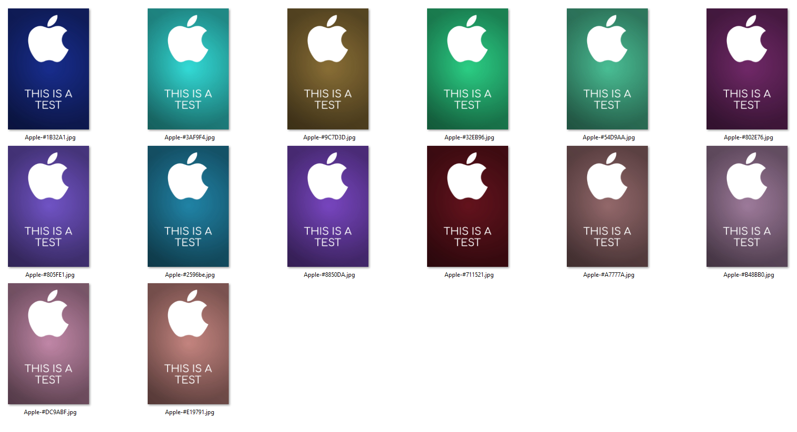
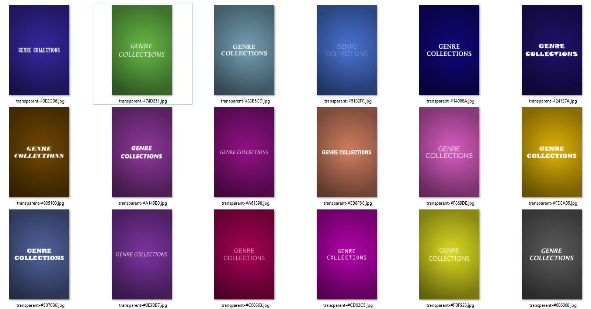
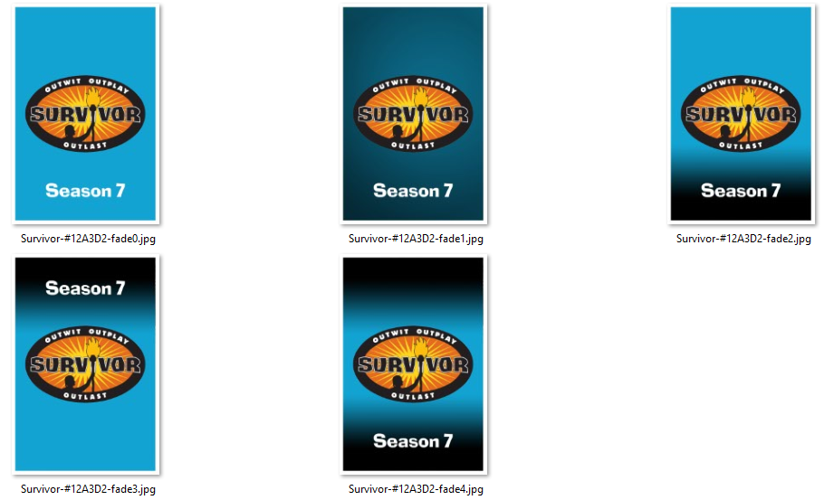
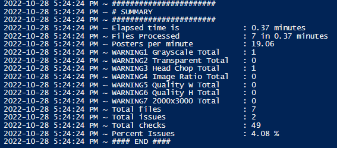
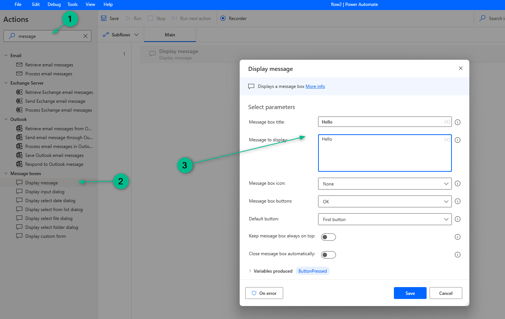
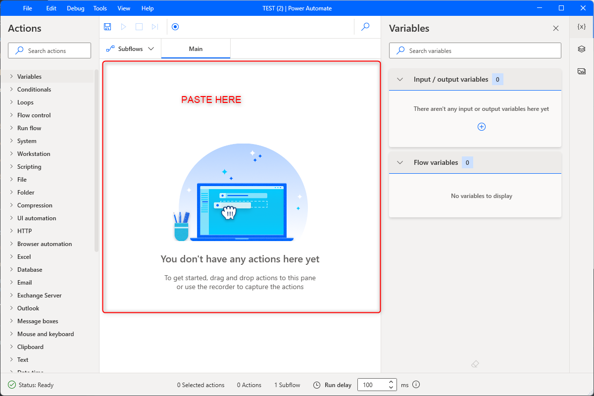
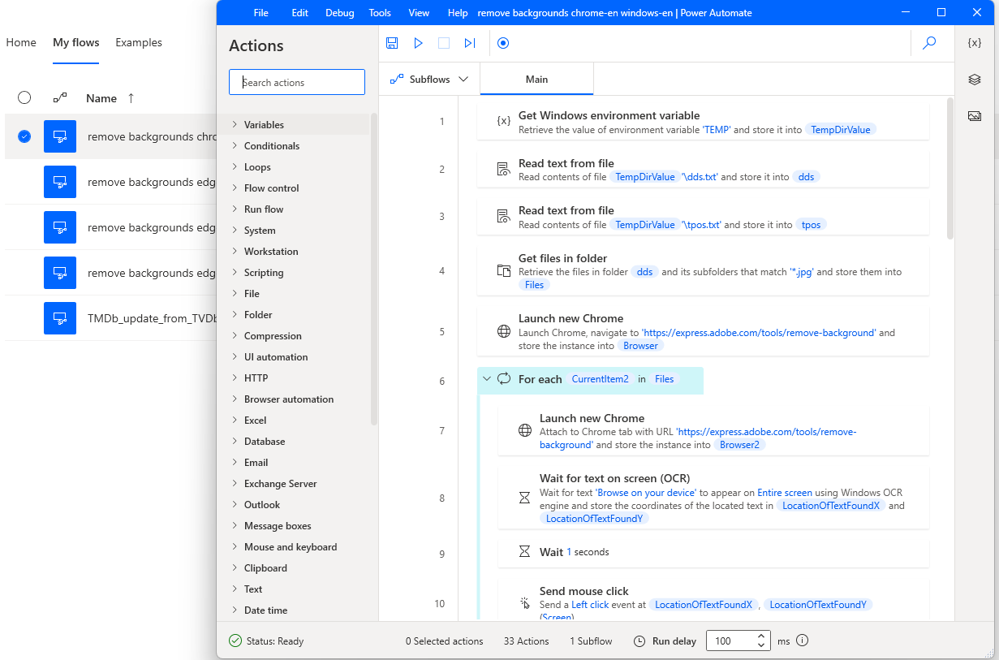
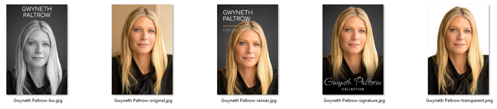
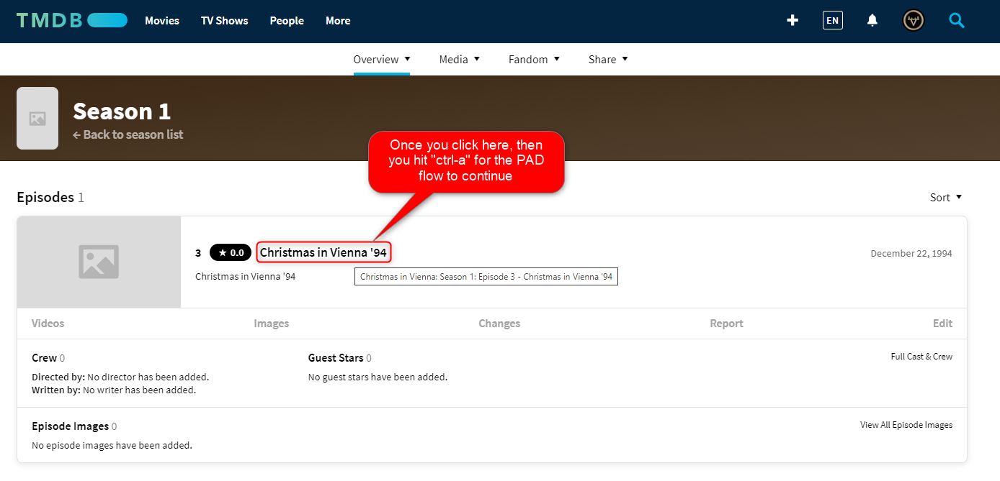

# Plex-Stuff
## Random plex related stuff

## Requirements

1. A system that can run powershell
2. A system that can also run Power Automate Desktop Flows
3. System that has ImageMagick installed

## Setup

1. clone repo

The Unraid bash scripts, Windows powershell or Windows cmd scripts, will vary in nature. Read the related section down below for more details. There is a separate section here for Python scripts. 

[Goto to Python Scripts Section](./pyprogs/README.md)

```bat 
D:\PLEX-STUFF\PYPROGS
├───collage
│   └───output
├───exif_overlay_checker
├───extract_tracks
├───fix_added_at
├───fmg
├───resizer
│   ├───input
│   └───output
├───tcc
└───update_plex_artist_art
```

## Scripts:
1. ~~[plex-bloat-fix.py](#plex-bloat-fix) - removes unneeded image files (Posters/Title Cards) from plex.~~ ***RETIRED!!! Please go here now: https://github.com/meisnate12/Plex-Image-Cleanup***
2. [plexdance.sh](#plexdance) - Unraid script to automate the full plexdance
3. [process-tcards.cmd](#process-tcards) - Windows script to create properly sized PLEX titlecards to use with TCM or for other purposes
4. [pumpanddump.sh](#pumpanddump) - Unraid script to automate the plex db repair when using hotio plex container
5. [chk-video-codec.sh](#chk-video-codec) - Unraid script to find and sort files that have been converted to HEVC/H265 and those that have not been
6. [create_poster.ps1](#create_poster) - Powershell script to create posters/images for PMM/PLEX/EMBY/JELLYFIN/OTHER
7. [get_missing_people.ps1](#get_missing_people) - Scans your PMM meta* logs to find missing people posters to download and create the bw, rainier, orig, etc. style poster for PMM/PLEX/EMBY/JELLYFIN/OTHER
8. [image_check.ps1](#image_check) - Scans your transparent images for anomalies like head-chops, backgrounds not removed, and black and white photos instead of a color photo to give you a report so you can go and fix those by uploading new and better options to https://www.themoviedb.org/
9. [create_people_poster.ps1](#create_people_poster) - Scans your PMM meta* logs to find missing people posters and will download and create the bw, rainier, orig, transparent. style poster for PMM/PLEX/EMBY/JELLYFIN/OTHER. This script was put together by using the image_check, get_missing_people, and Power Automate Desktop Flow (remove background) all into 1
10. [PAD Flows](#pad_flows) - Various PAD flows for RPA stuff for PLEX, PMM, Other
    1.  [1-Convert Warning- No TMDb ID Found for IMDb ID](#Convert_Warning_No_TMDb_ID_Found_for_IMDb_ID) - PAD flow to deal with Convert Warnings in your meta.log file from PMM
          2. [1-Convert Warning- No TMDb ID Found for IMDb ID-Subflow-close_browsers]
          3. [1-Convert Warning- No TMDb ID Found for IMDb ID-Subflow-Refresh_browser]
    1.  [2-Convert Warning- No TVDb ID Found for TMDb ID](#Convert_Warning_No_TVDb_ID_Found_for_TMDb_ID) - PAD flow to deal with Convert Warnings in your meta.log file from PMM
          2. [2-Convert Warning- No TVDb ID Found for TMDb ID-Subflow-close_browsers]
          3. [2-Convert Warning- No TVDb ID Found for TMDb ID-Subflow-Refresh_browser]
    1.  [3-Convert Warning- No TVDb ID or IMDb ID found for AniDB ID](#Convert_Warning_No_TVDb_ID_or_IMDb_ID_found_for_AniDB_ID) - PAD flow to deal with Convert Warnings in your meta.log file from PMM
          2. [3-Convert Warning- No TVDb ID or IMDb ID found for AniDB ID-Subflow-close_browsers]
          3. [3-Convert Warning- No TVDb ID or IMDb ID found for AniDB ID-Subflow-Refresh_browser]
    1.  [4-Convert Warning- No TMDb ID Found for TVDb ID](#4-Convert_Warning_No_TMDb_ID_Found_for_TVDb_ID) - PAD flow to deal with Convert Warnings in your meta.log file from PMM
          2. [4-Convert Warning- No TMDb ID Found for TVDb ID-Subflow-close_browsers]
          3. [4-Convert Warning- No TMDb ID Found for TVDb ID-Subflow-Refresh_browser]

For the above, there are subflows that should also be used as part of the flow. "Refresh_browser and close_browsers"

 
Here are the possible PMM errors/warnings found in the meta.log in relation to these auto/semi-auto PAD flows
```
Convert Warning: No TMDb ID Found for IMDb ID:
Convert Warning: No TVDb ID Found for TMDb ID:
Convert Warning: No TVDb ID or IMDb ID found for AniDB ID:
Convert Warning: AniDB ID not found for AniList ID:
Convert Warning: AniDB ID not found for MyAnimeList ID:
Convert Warning: No IMDb ID Found for TMDb ID:
Convert Warning: No TMDb ID Found for TVDb ID:
Convert Warning: No IMDb ID Found for TVDb ID:
Convert Warning: No TVDb ID Found for IMDb ID:
```
## ~~plex-bloat-fix~~

RETIRED!!! Please go here now: https://github.com/meisnate12/Plex-Image-Cleanup
 
~~Your PLEX folders are growing out of control. You use overlays from PMM or upload lots of custom art that you no longer want to use or need to eliminate. You don't want to perform the plex dance if you can avoid it. This script will free up gigs of space....It can also perform some PLEX operations like "empty trash", "clean bundles", and "optimize db". PBF also supports the use of PASSTHROUGH alerts to discord with notifiarr.com.~~

## plexdance

So your plex is hosed... and your DB and metadata is in a real mess... time for the plexdance. https://forums.plex.tv/t/the-plex-dance/197064 Quote: "The purpose of this is to remove all cached metadata and xml data for an item that Plex usually keeps. This helps when you want to “start from scratch” for particular item" My version will do a FULL plexdance on ALL of your libraries

### Usage
1. setup as above
2. edit the bash script so that the proper paths are used. I picked a very common structure, but this will depend on your setup
3. edit/comment the docker start and stop lines as needed
4. cp the bash script to a location accessible in Unraid terminal
5. Open Unraid terminal and navigate to the folder that contains the bash script
6. `chown 755 plexdance.sh` to ensure that you can run the script
7. Run with `./plexdance.sh`
8. follow prompts closely

## process-tcards

This script will use Imagemagick to produce title cards based on a folder that contains the episode titlecards stored as jpg. The end results will be in the `results` subfolder along with the `grayscale` subfolder

### Usage
1. Install latest windows version of Imagemagick (https://imagemagick.org/script/download.php#windows) 
2. Create a folder with the jpg files you want to process and place process-tcards.cmd in that same directory
3. Run `process-tcards.cmd`
4. Original files will not be touched and results are stored in `results` subfolder and the `grayscale` subfolder

## pumpanddump

This script will dump your plex db to a file and reimport it which usually repairs your db when you are seeing corruption and unable to download the db via the ui or the plexapi. This script is currently setup to work with the hotio plex container...... It ROCKS! https://hotio.dev/containers/plex/

### Usage
1. Copy the script into `/mnt/user/data/scripts/plex-scripts/pumpanddump` folder (or any other unraid scripts folder you use) 
2. Review the paths in the file like the `sqlplex=` variable (around line 5) and the `docker cp` line (around line 40)
3. Open a terminal session and navigate to that folder with the script and run: `chmod 755 pumpanddump.sh` to make it executable
4. Run `./pumpanddump.sh plex` where `plex` is the name of your container

## chk-video-codec

This script will go through the current directory and 10 levels down (if needed) to determine which files have been converted to HEVC/H265 and those that have not been.

### Usage
1. Copy the script into `/mnt/user/data/scripts/plex-scripts/chk-video-codec` folder (or any other unraid scripts folder you use) 
2. Review the paths in the file like the `ffprobe_path=` variable and ensure that you specify the full path to ffprobe which is part of the ffmpeg(http://www.ffmpeg.org/download.html) suite. Consider running the tdarr_node container in Unraid as the path I used is from that container.
3. Open a terminal session and navigate to that folder with the script and run: `chmod 755 chk-video-codec.sh` to make it executable
4. Goto the media folder that you want to scan and run `/mnt/user/data/scripts/plex-scripts/chk-video-codec/chk-video-codec.sh`
5. 3 log files will be created. Review them to see the results

## create_poster

This Powershell script will create posters/images for PMM/PLEX/EMBY/JELLYFIN/OTHER

### DESCRIPTION

In a powershell window and with ImageMagick installed, this will 
1. create a 2000x3000 colored poster based on $base_color parameter otherwise a random color for base is used and creates base_$base_color.jpg
2. it will add the gradient in the second line to create a file called gradient_$base_color.jpg
3. takes the $logo specified and sizes it 1800px (or whatever desired logo_size specified) wide leaving 100 on each side as a buffer of space
4. if a border is specified, both color and size of border will be applied
5. if text is desired it will be added to the final result with desired size, color and font
6. if white-wash is enabled, the colored logo with be made to 100% white
7. final results are a logo centered and merged to create a 2000x3000 poster with the $base_color color and gradient fade applied and saved as a jpg file (with an optional border of specified width and color and logo offset, as well as text, font, font_color, and font_size )
 
### REQUIREMENTS
Imagemagick must be installed - https://imagemagick.org/script/download.php

Font must be installed on system and visible by Imagemagick. Make sure that you install the ttf font for ALL users as an admin so ImageMagick has access to the font when running (r-click on font Install for ALL Users in Windows)

Powershell version 7.x or greater: https://learn.microsoft.com/en-us/powershell/scripting/install/installing-powershell-on-windows?view=powershell-7.3

Powershell security settings: https://learn.microsoft.com/en-us/powershell/module/microsoft.powershell.core/about/about_execution_policies?view=powershell-7.2

### PARAMETERS
`-logo`          (specify the logo/image png file that you want to have centered and resized)

`-logo_offset`   (+100 will push logo down 100 px from the center. -100 will move the logo up 100px from the center. Value is between -1500 and 1500. DEFAULT=0 or centered. -750 is the midpoint between the center and the top)

`-logo_resize`   (1000 will resize the log to fit in the poster.DEFAULT=1800.)

`-base_color`    (hex color code for the base background. If omitted a random color will be picked using the "#xxxxxx" format)

`-gradient`      (0=none, 1=center-out-fade, 2=bottom-up-fade, 3=top-down-fade, 4=bottom-top-fade, default=1)

`-text`          (text that you want to show on the resulting image. use \n to perform a carriage return and enclose text in double quotes.)

`-text_offset`   (+100 will push text down 100 px from the center. -100 will move the text up 100px from the center. Value is between -1500 and 1500. DEFAULT=0 or centered. +750 is the midpoint between the center and the bottom)

`-font`          (font name that you want to use. magick identify -list font magick -list font)

`-font_color`    (hex color code for the font. If omitted, white or #FFFFFF will be used)

`-font_size`     (default is 250. pick a font size between 10-500.)

`-border`        (default is 0 or $false - boolean value and when set to 1 or $true, it will add the border)

`-border_width`  (width in pixels between 1 and 100. DEFAULT=15)

`-border_color`  (hex color code for the border color using the "#xxxxxx" format. DEFAULT=#FFFFFF)

`-white_wash`    (default is 0 or $false - boolean value and when set to 1 or $true, it will take the logo and make it white)

`-clean`         (default is 0 or $false - boolean value and when set to 1 or $true, it will delete the temporary files that are created as part of the script)


### EXAMPLES
Create a poster with the Spotify.png logo and random background color with a black border that is 50 px wide. Temp files are deleted because "-clean 1"

`.\create_poster.ps1 -logo .\logos\Spotify.png -clean 1 -border_width 50 -border_color "#000000" -border 1`

Create a poster with the Spotify.png logo and random background color with a white border that is 15 px wide. Temp files are deleted because "-clean 1". Defaults of WHITE and Border width 15 are used

`.\create_poster.ps1 -logo .\logos\Spotify.png -clean 1 -border 1`

Create a poster with the Spotify.png logo and a black background color. Temp files are deleted because "-clean 1".

`.\create_poster.ps1 -logo .\logos\Spotify.png -base "#000000" -clean 1`

Create a poster with the Spotify.png and random background color. Temp files are deleted because "-clean 1".

`.\create_poster.ps1 -logo .\logos\Spotify.png -clean 1`

Create a poster with the Spotify.png and specified background color of "#FB19B9". Temp files are deleted because "-clean 1". border is enabled and width of 20px. Logo is moved up from the center by -750px.

`.\create_poster.ps1 -logo .\logos\Spotify.png -clean 1 -base "#FB19B9" -offset -750 -border_width 20 -border 1`





## get_missing_people

This Powershell script will find and download people posters/images for PMM/PLEX/EMBY/JELLYFIN/OTHER based on the PMM meta* logs

### DESCRIPTION

1. In a powershell window this will go through all your meta*.log files created by PMM to find all missing people posters.
2. It will create 1 .cmd file per meta.log file and run it to download the images locally
 
### REQUIREMENTS
$metalog_location=is the path to the logs directory for PMM

Powershell security settings: https://learn.microsoft.com/en-us/powershell/module/microsoft.powershell.core/about/about_execution_policies?view=powershell-7.2

### PARAMETERS
`-metalog_location`          (specify the logs folder location for PMM)

### EXAMPLES
Run script against the \\NZWHS01\appdata\Plex-Meta-Manager\logs folder

`.\get_missing_people.ps1 -metalog_location \\NZWHS01\appdata\Plex-Meta-Manager\logs`


## image_check

This Powershell script will scan your transparent images for anomalies like head-chops, backgrounds not removed, and black and white photos instead of a color photo to give you a report so you can go and fix those by uploading new and better options to https://www.themoviedb.org/

### DESCRIPTION

1. In a powershell window this will go through all your images in the images folder mentioned to scan and report anomalies
2. It will create an output log that you can review and fix issues by uploading to https://www.themoviedb.org/ and ensuring that its a primary so that when it gets downloaded, the proper image can be processed by other scripts
 
### REQUIREMENTS
$images_location=is the path to the directory with the transparent images to verify

Powershell version 7.x or greater: https://learn.microsoft.com/en-us/powershell/scripting/install/installing-powershell-on-windows?view=powershell-7.3

Powershell security settings: https://learn.microsoft.com/en-us/powershell/module/microsoft.powershell.core/about/about_execution_policies?view=powershell-7.2

### PARAMETERS
`-images_location`          (specify the images folder location for script to scan and report on)

### EXAMPLES
Run script against the c:\temp\people\transparent folder

`.\image_check.ps1 -images_location c:\temp\people\transparent`



## create_people_poster

This Powershell script will find and download people posters/images for PMM/PLEX/EMBY/JELLYFIN/OTHER based on the PMM meta* logs

### DESCRIPTION

1. In a powershell window this will go through all your meta*.log files created by PMM to find all missing people posters.
2. It will create 1 .cmd file per meta.log file and run it to download the images locally
3. It will then scan, remove the background, and produce 4 files all at 2000x3000 in size
- bw-style
- diiivoy-style
- diiivoycolor-style
- rainier-style
- original-style
- signature-style
- transparent-style
 
### REQUIREMENTS
$metalog_location=   is the directory path to scan the PMM directory logs (meta*.log)

Powershell version 7.x or greater: https://learn.microsoft.com/en-us/powershell/scripting/install/installing-powershell-on-windows?view=powershell-7.3

Powershell security settings: https://learn.microsoft.com/en-us/powershell/module/microsoft.powershell.core/about/about_execution_policies?view=powershell-7.2

Imagemagick must be installed - https://imagemagick.org/script/download.php

$flowName=           is the PAD Flow name that you want to call for your setup

If your system is missing fonts, you will be prompted to install the ones that are extracted before continuing

PAD Flows included in this repo are:
- `remove backgrounds chrome-en windows-en`     => Windows OS is in English and Chrome in English
- `remove backgrounds edge-en windows-en`       => Windows OS is in English and Edge in English
- `remove backgrounds edge-en windows-fr`       => Windows OS is in French and Edge in English
- `remove backgrounds edge-fr windows-fr`       => Windows OS is in French and Edge in French

Power Automate Desktop on a Windows Machine with the flow that will access Adobe Express Online ( https://express.adobe.com/tools/remove-background ) to remove backgrounds in an automated fashion. Download found here ( https://go.microsoft.com/fwlink/?linkid=2102613 ). Ensure that you install the chrome and edge web browser extensions.
## pad_flows_install
PAD Installation steps
1. Install PAD and Extensions
2. Create a new flow and name it as one of the flows included in this repo (described above)

3. Open the text file flow in a text editor and select all the text (ctrl-a) and copy it (ctrl-c)

4. In the newly created flow, paste (ctrl-v) the text in the "white" empty area

5. You should see all the steps pasted into the GUI

6. Repeat for the Subflows if they exist by only adding the subflow like Refresh_browser and closer_browsers
7. Save the flow

### PARAMETERS
`-metalog_location`          (specify the logs folder location for PMM)

`-flowName`                  (specify the flow name that you want to use)

### EXAMPLES
Run script against the \\NZWHS01\appdata\Plex-Meta-Manager\logs folder on a Windows English machine with Chrome in English

`.\create_people_poster.ps1 -metalog_location \\NZWHS01\appdata\Plex-Meta-Manager\logs -flowname "remove backgrounds chrome-en windows-en"`

Run script against a folder where you copied some meta*.log files from D:\logs on a Windows English machine with Edge in English

`.\create_people_poster.ps1 -metalog_location D:\logs -flowname "remove backgrounds edge-en windows-en"`



## pad_flows
PAD Flows
## 1 - Convert_Warning_No_TMDb_ID_Found_for_IMDb_ID
- `1 - Convert Warning- No TMDb ID Found for IMDb ID` => Windows OS is in English and Edge in English
- See [PAD Flows Install](#pad_flows_install)
- Before starting. ensure that you have a tmdb account and that you logged in so that the cached credentials will work before trying this....

`ctrl-a` is used to ensure that the flow waits until you find/click on the actual episode in TMDB (See image)
1. 2 browsers will open to assist you to link the missing ids
   1. 1st browser stays on the found IMDB page
   2. 2nd is the one you use to navigate to find the episode on tmdb after a google search is done for you by the flow
2. Once you hit `ctrl-a`, automation fully takes over and will process the addition if it determines that one is needed. It will then close both browsers down and go to the next imdb id that was missing and reported from the selected meta.log
3. Logging is enabled and found in the same directory that you chose for the meta.log in the early steps in the flow. 
   1. `tmdbupdater.log` which is the full status of steps completed by the flow
   2. `tmdbupdater-progress.log` contains your progress. 
   3. `tmdbconvert.log` is a stripped down version of the meta.log

Error checking is enabled and does the following:
 - if you hit `ctrl-a` and you are not on tmdb, this usually means that you cannot find the episode on tmdb and hence you want to "skip" it
 - if you hit `ctrl-a` and the imdb external id field is already populated (it happens as the community updates these things), it will log and skip it
 - if you hit `ctrl-a` and you get an error upon save, then that is logged and continues. if its a success, that is logged and continues
 - if you hit `ctrl-a` and you are somehow in tmdb in another language or the episode and its show is not in tmdb in ENGLISH, then the script will try to add the english translation and continue to try again to add the id in the subsequent iteration (This has not been tested because I have not encountered this yet but I know it happens because of the other flow I have used in the past)

## 2 - Convert_Warning_No_TVDb_ID_Found_for_TMDb_ID
- `2 - Convert Warning- No TVDb ID Found for TMDb ID` => Windows OS is in English and Edge in English
- See [PAD Flows Install](#pad_flows_install)
- Before starting. ensure that you have a tmdb account and that you logged in so that the cached credentials will work before trying this....

## 3 - Convert_Warning_No_TVDb_ID_or_IMDb_ID_found_for_AniDB_ID
- `3 - Convert Warning- No TVDb ID or IMDb ID found for AniDB ID` => Windows OS is in English and Edge in English
- See [PAD Flows Install](#pad_flows_install)
- Before starting. ensure that you have a tmdb and anidb account and that you logged in so that the cached credentials will work before trying this....
- AniDb does TMDb and IMDb  as well as MAL links 
- TMDb tv has IMDb and TVDb external links 
- TMDb movies has IMDb external link
- The PAD flow I built launches 6 browsers to six different sites and attempts to give you a summary of what it finds… it launches AniDb, MAL, AniList, TVDb, IMDb, and TMDb. Then it tries to match up as much as possible and gives you a summary of what it finds.
- You then decide where to make your fixes based on the summary and the pages the script finds for you. You hit save on the sites that you have updated and then you hit `ctrl-s` to have it continue to attempt finding the next ID that was not matched from PMM 

## 4-Convert_Warning_No_TMDb_ID_Found_for_TVDb_ID
- `4-Convert Warning No TMDb ID Found for TVDb ID` => Windows OS is in English and Edge in English
- See [PAD Flows Install](#pad_flows_install)
- Before starting. ensure that you have a tmdb account and that you logged in so that the cached credentials will work before trying this....


- So far, this is as far as I got so it’s far from perfect, and still pretty manual, but effective.
